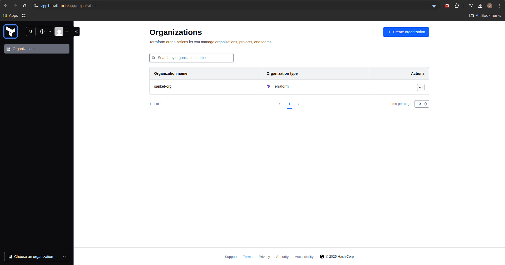
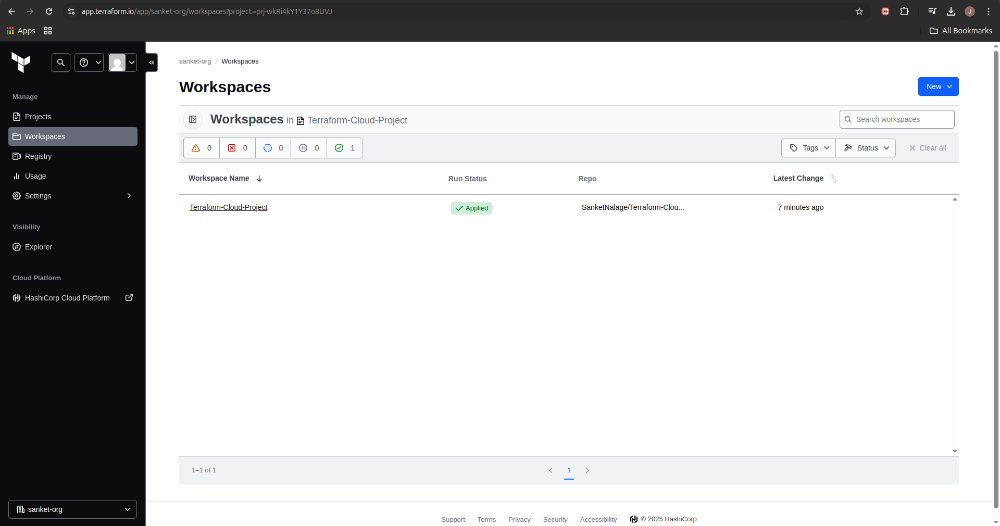
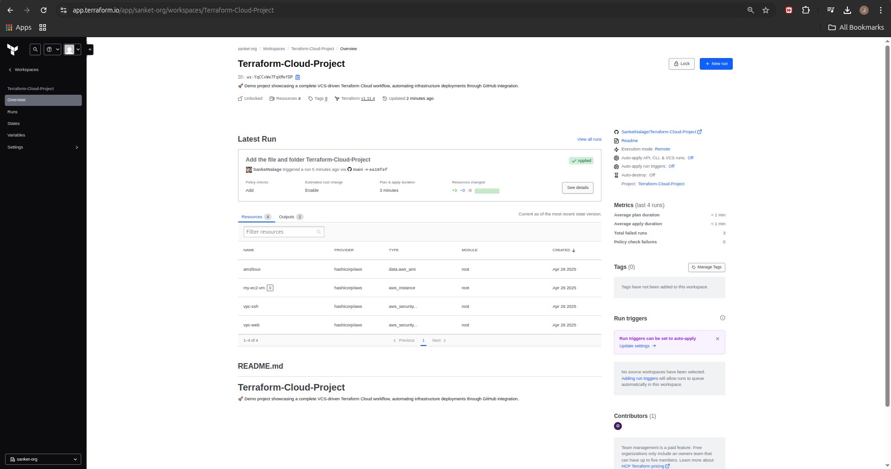
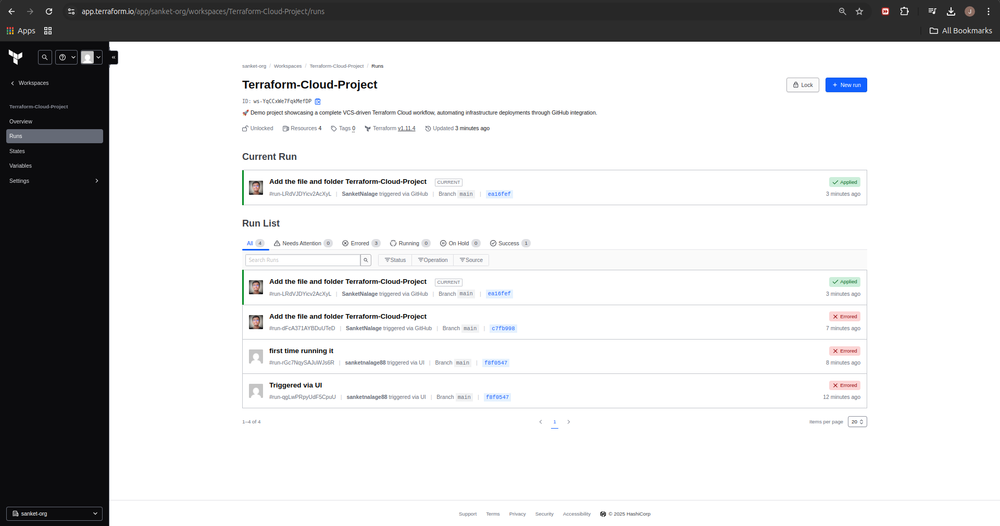
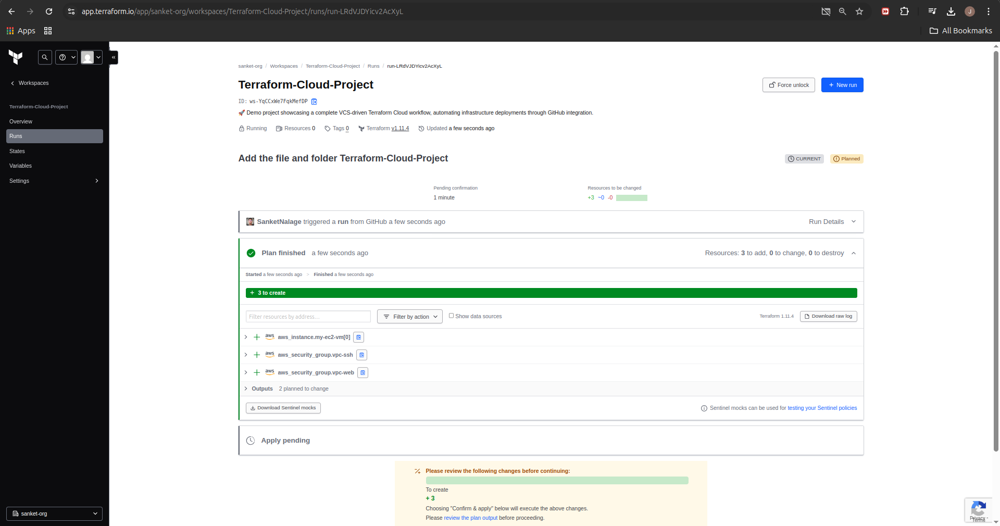
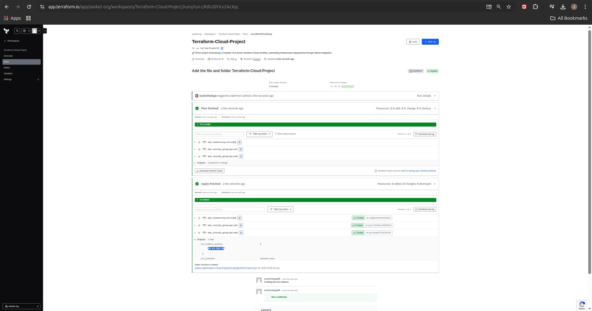
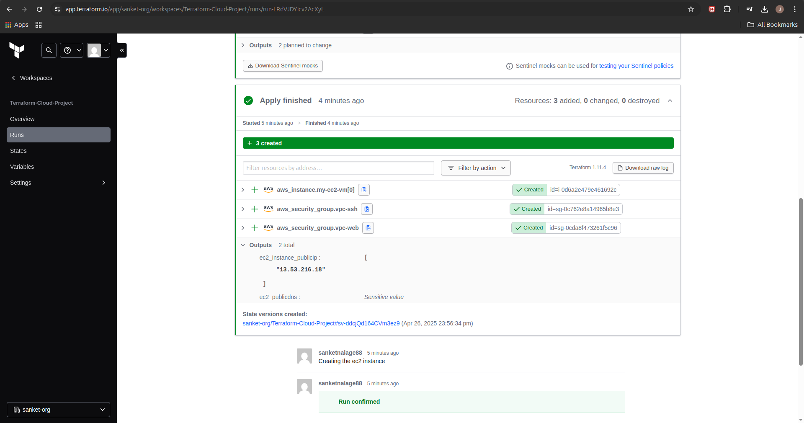
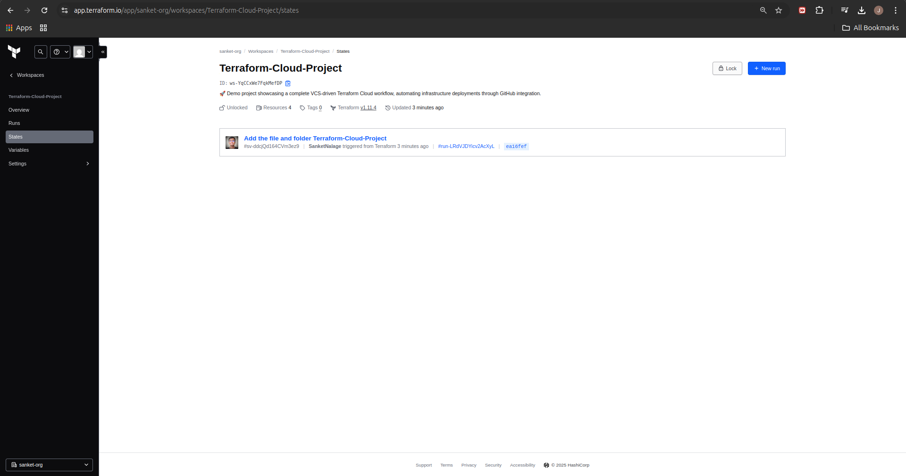

# Terraform-Cloud-Project
🚀 Demo project showcasing a complete VCS-driven Terraform Cloud workflow, automating infrastructure deployments through GitHub integration.

## Step-01: Sign-Up for Terraform Cloud - Free Account & Login
- **SignUp URL:** https://app.terraform.io/signup/account
- **Username:**
- **Email:**
- **Password:** 
- **Login URL:** https://app.terraform.io

# Step-02: Create Organization 
- **Organization Name:** sanket-org
- **Email Address:** give the email which you used at login of Terraform.io
- Click on **Create Organization**
 

 

## Step-03: Create New Workspace
- Get in to newly created Organization
- Click on **New Workspace**
- **Choose your workflow:** 
  - Version Control Workflow
- **Connect to VCS**
  - **Connect to a version control provider:** github.com
  - NEW WINDOW: **Authorize Terraform Cloud:** Click on **Authorize Terraform Cloud Button**
  - NEW WINDOW: **Install Terraform Cloud**
  - **Select radio button:** Only select repositories
  - **Selected 1 Repository:** SanketNalage/Terraform-Cloud-Project
  - Click on **Install**
- **Choose a Repository**
  - SanketNalage/Terraform-Cloud-Project
- **Configure Settings**
  - **Workspace Name:** Terraform-Cloud-Project (Whatever populated automically leave to defaults) 
  - **Advanced Settings:** leave to defaults 
- Click on **Create Workspace**  
- You should see this message `Configuration uploaded successfully`
 

 
 

 

## Step-04: Configure Variables
- **Variable:** aws_region
  - key: aws_region
  - value: eu-north-1
- **Variable:** instance_type
  - key: instance_type
  - value: t3.micro

## Step-05: Configre Environment Variables
- [Setup AWS Access Keys for Terraform](https://registry.terraform.io/providers/hashicorp/aws/latest/docs#environment-variables)
- Configure AWS Access Key ID and Secret Access Key  
- **Environment Variable:** AWS_ACCESS_KEY_ID
  - Key: AWS_ACCESS_KEY_ID
  - Value: XXXXXXXXXXXXXXXXXXXXXX
- **Environment Variable:** AWS_SECRET_ACCESS_KEY
  - Key: AWS_SECRET_ACCESS_KEY
  - Value: YYYYYYYYYYYYYYYYYYYYYYYYYYYYYYYYYYY

## Step-06: Click on Queue Plan
- Go to Workspace -> Runs -> Queue Plan
- Review the plan generated in **Full Screen**
- **Add Comment:** First Run
- Click on **Confirm & Apply**
- **Add Comment:** First Run Approved
- Click on **Confirm Plan**
- Review Apply log output in **Full Screen**
- **Add Comment:** Successfully Provisioned, Verified in AWS
 

   
 

  
 

  
 

  

## Step-07: Review Terraform State
- Go to Workspace -> States
- Review the state file
 

  

